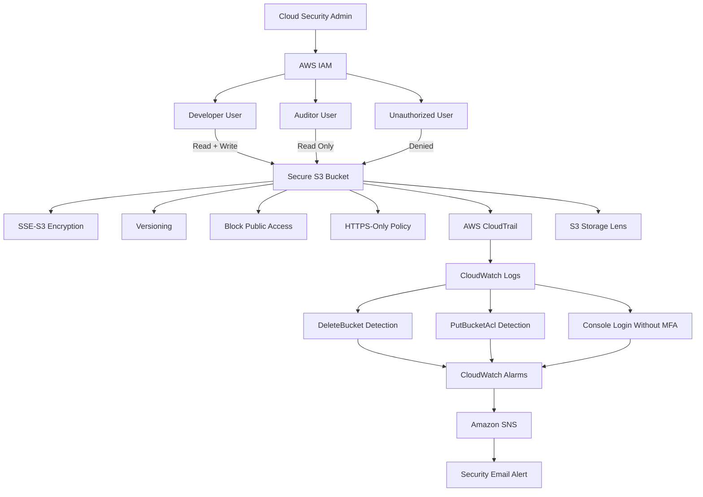

# Secure Cloud Storage & Threat Detection on AWS

Hands-on AWS cloud security project demonstrating secure S3 storage, least-privilege IAM, centralized audit logging, detection engineering, alerting, remediation, and storage visibility.

## Project Overview

This lab was built from the perspective of a **Cloud Security Analyst**. The goal was to secure an Amazon S3 environment, restrict access by role, monitor security-relevant activity, generate controlled security events, detect them with AWS-native services, and verify remediation.

### AWS services used

- Amazon S3
- AWS Identity and Access Management (IAM)
- AWS CloudTrail
- Amazon CloudWatch Logs
- CloudWatch Metric Filters and Alarms
- Amazon SNS
- IAM Access Analyzer policy validation
- S3 Storage Lens

## Architecture



## 1. Secure S3 Configuration

The primary S3 bucket was hardened with multiple preventive controls:

- **Block All Public Access:** enabled
- **Object Ownership:** Bucket owner enforced
- **ACLs:** disabled
- **Versioning:** enabled
- **Encryption:** SSE-S3
- **HTTPS-only access:** enforced through a bucket policy

Public object access was tested from an unauthenticated browser session and correctly returned **AccessDenied**.

## 2. HTTPS-Only Bucket Policy

The bucket denies requests that do not use secure transport. A sanitized example is stored in [`policies/s3-https-only-policy.json`](policies/s3-https-only-policy.json).

## 3. Least-Privilege IAM

Three security personas were tested:

| Persona | List target bucket | Read object | Write object | Result |
|---|---:|---:|---:|---|
| Developer | Allowed | Allowed | Allowed | Expected |
| Auditor | Allowed | Allowed | Denied | Expected |
| Unauthorized | Denied | Denied | Denied | Expected |

### Developer

The developer policy grants only the permissions required to work with objects in the lab bucket:

- `s3:ListBucket`
- `s3:GetObject`
- `s3:PutObject`

The developer successfully read an existing object and uploaded a test object while remaining restricted from administrative S3 configuration.

### Auditor

The auditor policy grants read-only access:

- `s3:ListBucket`
- `s3:GetObject`

An upload attempt as the auditor failed with **Access denied**, confirming separation of duties.

## 4. IAM Policy Validation

Both customer-managed IAM policies were checked with AWS policy validation / IAM Access Analyzer.

### Developer policy

- Security findings: **0**
- Errors: **0**
- Warnings: **0**
- Suggestions: **0**

### Auditor policy

- Security findings: **0**
- Errors: **0**
- Warnings: **0**
- Suggestions: **0**

## 5. CloudTrail Monitoring

A dedicated CloudTrail trail was configured and verified with:

- Logging enabled
- Multi-region trail enabled
- Log file validation enabled
- Management events enabled
- S3 object-level data events enabled for the lab bucket
- Delivery to CloudWatch Logs

This provided visibility into administrative actions and object-level S3 activity.

## 6. Detection Engineering with CloudWatch

CloudWatch metric filters and alarms were created for the following security events:

| Detection | Metric filter | Alarm |
|---|---|---|
| S3 bucket deletion | `DetectDeleteBucket` | `S3-DeleteBucket-Detected` |
| S3 ACL change | `DetectPutBucketAcl` | `S3-PutBucketAcl-Detected` |
| Console login without MFA | `DetectConsoleLoginWithoutMFA` | `ConsoleLogin-Without-MFA-Detected` |

The no-MFA detection looks for CloudTrail `ConsoleLogin` events where `MFAUsed` is `No`.

## 7. SNS Alerting

CloudWatch alarms publish to the SNS topic:

`CloudSecurityLabAlerts`

A confirmed email subscription was configured. A direct SNS message was successfully delivered, and a controlled login without MFA later generated a real CloudWatch alarm email.

Detection pipeline validated:

**User Activity → CloudTrail → CloudWatch Logs → Metric Filter → Alarm → SNS → Email**

## 8. Security Testing

Controlled tests were performed to validate both preventive and detective controls.

### Public access test

A direct S3 object URL was opened without authentication.

**Result:** `AccessDenied`

### Developer test

The developer account successfully:

- listed objects in the target bucket
- read an object
- uploaded a test object

### Auditor test

The auditor account successfully read the test object but received **Access denied** when attempting an upload.

### Unauthorized access test

An IAM account without S3 permissions was unable to enumerate/access the protected S3 resources.

### Object deletion test

An S3 object was deleted and the `DeleteObject` data event was found in CloudWatch Logs Insights.

Example query:

```sql
fields @timestamp, eventName, eventSource, userIdentity.userName,
       requestParameters.bucketName, requestParameters.key
| filter eventName = "DeleteObject"
| sort @timestamp desc
| limit 20
```

## 9. Object Recovery with Versioning

Because versioning was enabled, deleting the object created a delete marker rather than destroying all object versions.

The delete marker was removed and the original object was restored successfully.

This demonstrated recovery from accidental deletion.

## 10. PutBucketAcl Detection Test

A temporary S3 bucket was used to safely generate a controlled `PutBucketAcl` event. The event was captured by CloudTrail and used to validate the CloudWatch detection pipeline.

After testing, the temporary bucket was deleted as part of remediation.

## 11. Remediation and Final Security Review

After testing, the environment was returned to a secure baseline and rechecked:

- Block Public Access remained enabled
- Bucket owner enforced remained enabled
- ACLs remained disabled on the main bucket
- HTTPS-only bucket policy remained present
- Administrative MFA remained enabled
- Developer permissions remained scoped to required actions
- Auditor permissions remained read-only
- Temporary ACL test bucket was removed
- CloudTrail remained active and multi-region

## 12. S3 Storage Lens

The default S3 Storage Lens dashboard was enabled and reviewed for:

- total storage
- object count
- average object size
- active buckets
- regional distribution
- storage-class distribution
- bucket-level storage usage

This added storage visibility and governance monitoring to the project.

## 13. Troubleshooting Highlight: SNS Alert Delivery

During the project, the intended SNS alert topic was missing. The issue was investigated and resolved by:

1. identifying that the expected topic was no longer present
2. recreating the `CloudSecurityLabAlerts` topic
3. creating and confirming a new email subscription
4. publishing a direct SNS test message
5. reconnecting CloudWatch alarm actions to the topic
6. generating another no-MFA login event
7. verifying delivery of the real alarm email

This was a useful troubleshooting exercise across CloudWatch, SNS, IAM, and CloudTrail rather than a simple configuration-only lab.

## Security Concepts Demonstrated

- Least privilege
- Separation of duties
- Defense in depth
- MFA
- Data-at-rest encryption
- Data-in-transit protection
- Public cloud exposure prevention
- Centralized audit logging
- S3 data-event monitoring
- Detection engineering
- Security alerting
- Incident investigation
- Remediation
- Object recovery
- Cloud security posture validation

## Key Learnings

This project provided hands-on experience with:

- designing least-privilege IAM policies
- securing S3 against public exposure
- validating IAM policies with AWS-native tooling
- configuring multi-region CloudTrail
- collecting S3 object-level data events
- building CloudWatch security detections
- integrating CloudWatch alarms with SNS
- investigating cloud security events
- recovering deleted S3 objects using versioning
- testing and remediating cloud misconfigurations
- reviewing storage posture with S3 Storage Lens

## Repository Structure

```text
.
├── README.md
├── policies/
│   ├── s3-developer-policy.json
│   ├── s3-auditor-policy.json
│   └── s3-https-only-policy.json
└── screenshots/
    └── Evidence screenshots can be added here
```

## Project Status

- AWS technical implementation: **Complete**
- Security testing: **Complete**
- Detection and alerting: **Complete**
- Remediation: **Complete**
- Storage Lens review: **Complete**
- Documentation: **Complete**

> **Security note:** Repository examples are sanitized for public portfolio use. No AWS access keys, secret keys, session tokens, passwords, MFA secrets, or other credentials should be committed to this repository.
